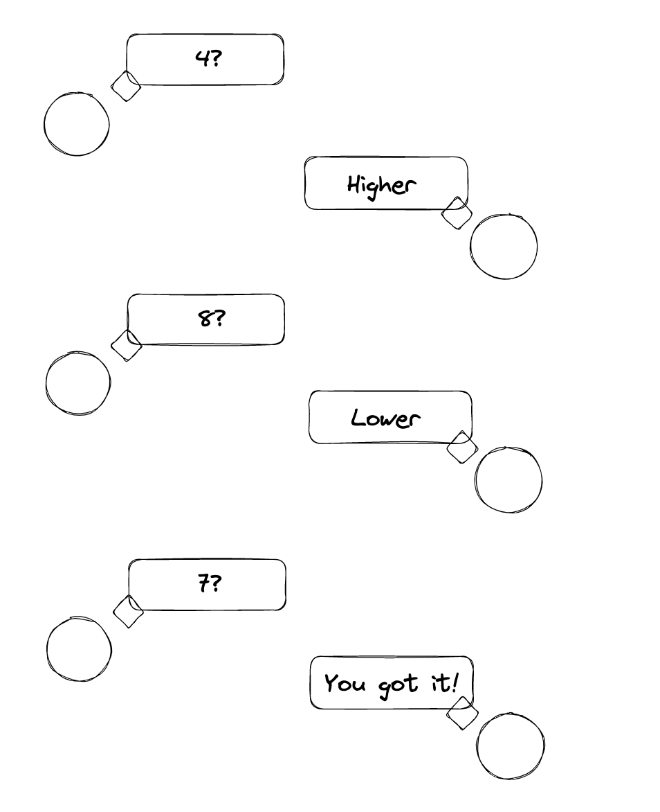
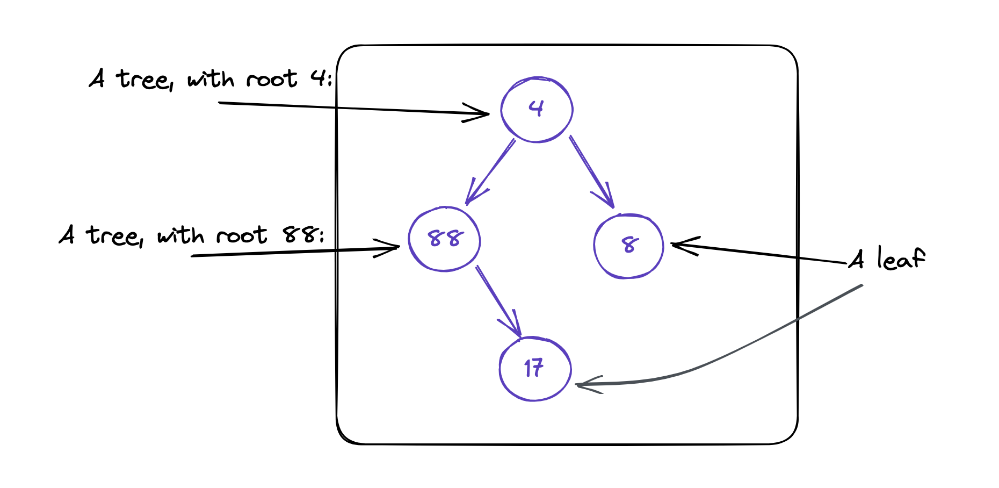
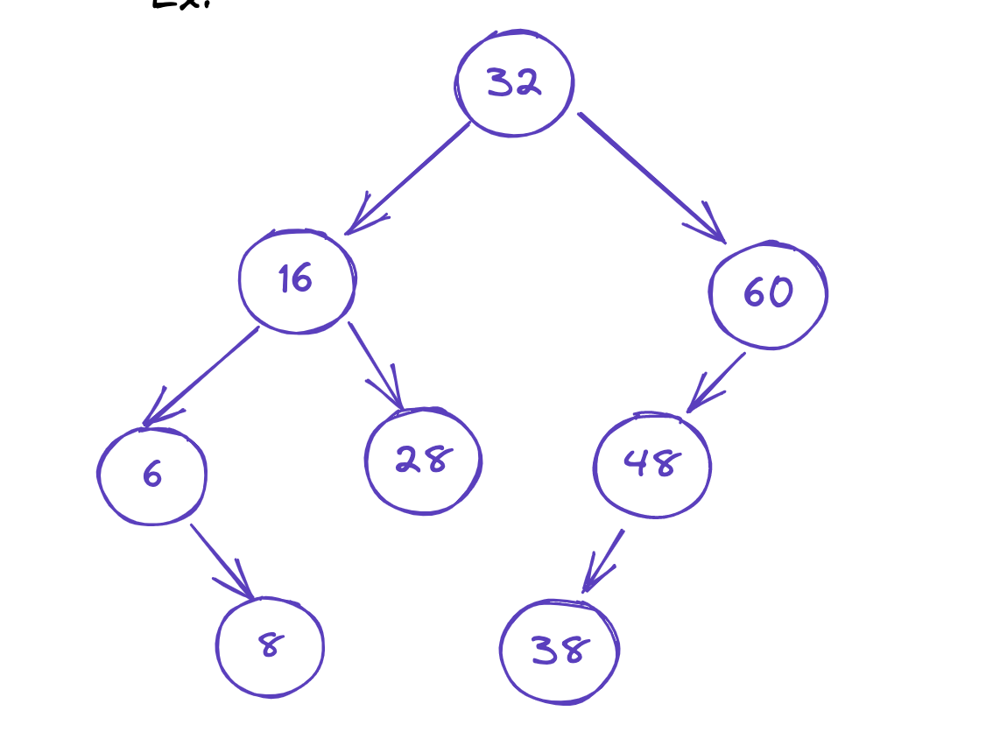
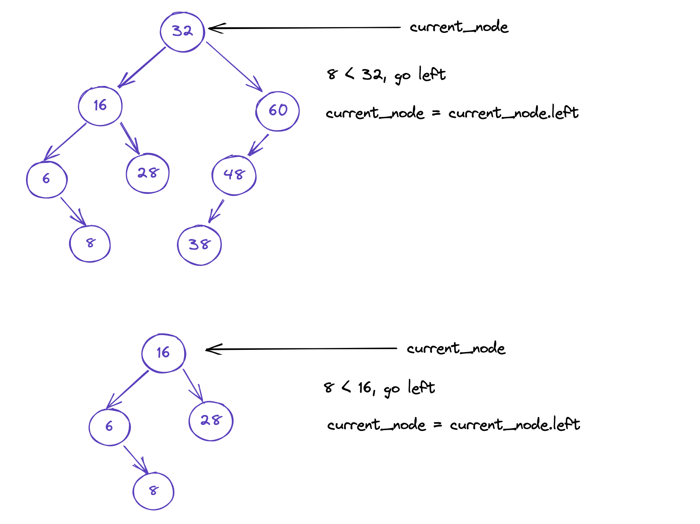
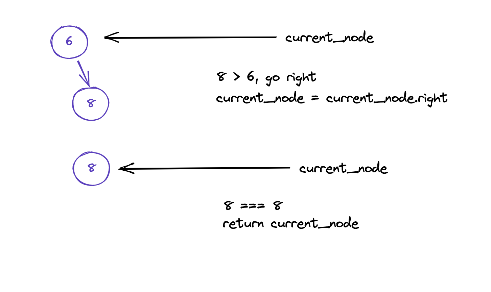

# Binary Search / Binary Search Tree

## What is Binary Search?

### An intuitive example

- 2 player game
- first player picks a number between 1-10 (inclusive)
- second player needs to guess the number
- on every incorrect guess first player gives feedback "lower/higher"
- second player wins when they guess the correct number

### What is our algorithm?

Q: What is the optimal strategy for player 2?
A: Guess down the middle each time

> Why? Eliminates the maximum amount of wrong answers at a time given the higher/lower feedback

In computer science we like to think with the power of 2 because
of how everything is ultimately binary (0 or 1) so let's consider the 
example of guessing a number between 0-63 (inclusive)

### A more thorough example

Player 1: Chooses 63

Player 2:
Guess #1:
    possible values: 0-63
    guess: 31 (63-0 = 63, 63/2 = 31.5, 0 + floor(31.5) = 31)
    feedback: Higher

Guess #2:
    possible values: 32-63
    guess: 47 (63-32 = 31, 31/2 = 15.5, 32 + floor(15.5) = 47)
    feedback: Higher

Guess #3:
    possible values: 48-63
    guess: 55 (63-48 = 15, 15/2 = 7.5, 48 + floor(7.5) = 55)
    feedback: Higher

Guess #4:
    possible values: 56-63
    guess: 58 (63-56 = 7, 7/2 = 3.5, 56 + floor(3.5) = 58)
    feedback: Higher

Guess #5:
    possible values: 59-63
    guess: 61 (63-59 = 4, 4/2 = 2, 59 + 2 = 61)
    feedback: Higher

Guess #6:
    possible values: 62-63
    guess: 62 (63-62 = 1, 1/2 = 0.5, 62 + floor(0.5) = 62)
    feedback: Higher

Guess #7: must be 63!

### Analysis

We chose 0-63 on purpose, because that is 64 values, 
which is 2^6. 

We chose for player #1 to choose 63, because that creates a
worst case scenario for our algorithm. Because we are always splitting down the middle we will actually guess first or last values only once we have exhausted the rest of our search space.

Every incorrect guess we learnt new info and this cut our search set in half repeatedly:

0-63 => 32-63 => 48-63 => 56-63 => 59-63 => 62-63

Because of our halfing strategy we only needed to split the
search set a maximum of 6 times before we had a definitive answer

> Now consider for yourself how our algorithm would respond to the search set doubling, so 0-127? What about 0-255?

Because we half the search set at each guess, that's only
one additional guess per doubling of the search space! 
This is where we get the complexity analysis guarantee of `O(log n)`

### Complexity analysis of Binary Search

In computer science when we use the log function we assume the 'base' of log is 2, so:

- log(4) = 2, because 2^2 = 4
- log(64) = 6, because 2^6 = 64
- log(128) = 7, because 2^7 = 128

This means that as our input size doubles, our algorithm's
time complexity only grows by 1. This is important because this
is the best 'class' of Big-O possible. And, as it turns out, 
binary search is the *only* algorithm that makes such a guarantee.

# **BIG TAKE HOME**

If you are halving the search set every iteration of a loop, you are
doing binary search, thats `O(log n)`

If you solve a problem by looking through all elements of an array
`O(n)` and the interviewer asks if you can optimize the algorithm any better
then they are asking you if there's is a binary search `O(log n)` solution.
Maybe there isn't, maybe there is but you just can't come up with it, but
knowing they are talking about binary search and being able to use that term
means you understand and can talk the language of complexity analysis.

### What is a Binary Search Tree (BST)?

A BST is very similar to the concept of binary search, but is specifically about
a tree data structure.

Remember a Tree consists of either:
- a leaf, a node with no children or
- a tree, a node with 1-2 children

A tree is therefore a recursive data structure, so:

Basically, a tree is a data structure with children, and those
children are themselves trees. If that child is a tree with no children
we give this the special name of 'leaf' because it is terminating
(a 'base case' as far as recursion is concerned.)

The above is a *binary tree*, i.e. a tree with maximum 2 children at each node.

So what is a *Binary **Search** Tree*?

A *Binary Search Tree (BST)* is a tree with a special quality:

For any node in the tree:
- all children to the left have a lower value than their parent node
- all children to the right have a higher value than their parent node

Ex:

Notice the structure here. Because of the rules a given nodes
left child is always smaller, and the right always larger. But
because of this recursive structure the definition also ends up being
recursive! So all nodes to the left, at any level, are smaller, and the
inverse is true for the right side.

This means such a tree is a perfect match for binary search!

Example:

Given the above BST, search the node with value 8, and return it if it exists

### Code examples

I created 2 examples in JavaScript so you can see it implemented concretely.

The [first example](./binarySearch.js) is binary search applied to a standard array.

The [second example](./binarySearchTree.js) is binary search implemented for a BST.

### General tips

Note that in both cases you are guaranteed the input in some form, as binary search will only work on a sorted array or a tree satisfying the BST guarantees and either of these properties in your input data can clue you into the idea that binary search is a good approach.

Also note that binary search can be somewhat finicky when determining the middle value so it's wise to test it and make sure it works correctly as off-by-one errors are common.

### Practice Problems

#### Easy

- [Binary Search](https://leetcode.com/problems/binary-search)

- [First Bad Version](https://leetcode.com/problems/first-bad-version)

- [Lowest Common Ancestor of a Binary Search Tree](https://leetcode.com/problems/lowest-common-ancestor-of-a-binary-search-tree)

#### Medium

- [Search in Rotated Sorted Array](https://leetcode.com/problems/search-in-rotated-sorted-array)

- [Time Based Key-Value Store](https://leetcode.com/problems/time-based-key-value-store)

- [Validate Binary Search Tree](https://leetcode.com/problems/validate-binary-search-tree)

